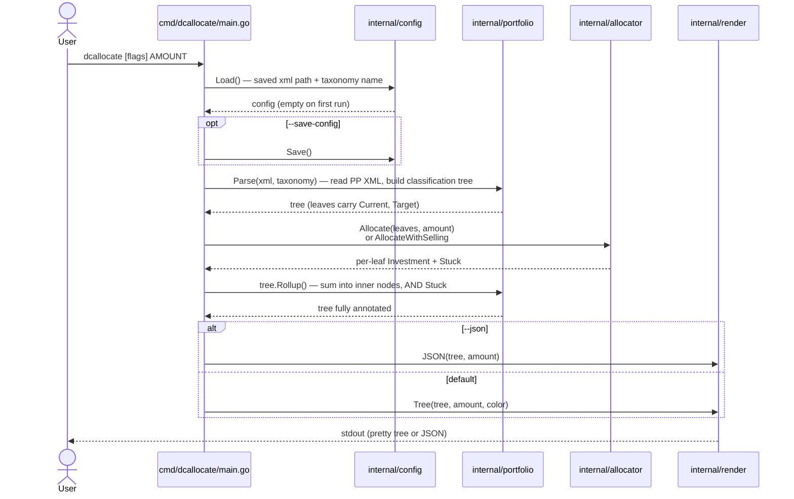

# :curly_loop: dcallocate

- :heavy_dollar_sign: **`dcallocate`** enables **rebalancing by investing** (no selling), which minimizes fees and realized-gains tax. (Its `--allow-selling` flag also allows a closed-form rebalance that may include sells.)
- :jigsaw: Reads [PortfolioPerformance](https://www.portfolio-performance.info/) XML directly: fills a gap PP's own allocation tool doesn't cover.
- :package: Single static binary, **zero third-party dependencies**.

Selling assets to keep a portfolio balanced causes additional costs (order fees, realized-gains tax) and, when contributions are large enough relative to the divergence between the assets current values and targets, is not required. PortfolioPerformance has an allocation tool, but only the selling-allowed variant, `dcallocate` solves the no-selling allocation problem and fills that gap.

The mathematical complexity it handles cleanly: when one or more assets are already over their target weight, those assets receive nothing, and the contribution is distributed among the others — which can in turn push *those* over target, **recursively**. The technique `dcallocate` applies has a couple of names: **rebalance by investing** (the descriptive English) and **water-filling** (the projection-onto-the-simplex math behind it).

For the full math derivation, correctness proof, and an R reference implementation, see the [companion study](https://github.com/Konilo/sandbox/blob/main/sandbox/portfolio_contribution_complexities/portfolio_contribution_complexities.pdf) in [Konilo/sandbox](https://github.com/Konilo/sandbox).

## Install

Download the right binary from the [latest release](https://github.com/Konilo/dcallocate/releases) and put it on your `PATH`:

| OS                    | Binary                         | Where to put it                                                                          |
| --------------------- | ------------------------------ | ---------------------------------------------------------------------------------------- |
| Windows               | `dcallocate-windows-amd64.exe` | rename to `dcallocate.exe`, drop in `%USERPROFILE%\bin\` (and ensure that's on `PATH`)   |
| Linux (x86_64)        | `dcallocate-linux-amd64`       | `~/.local/bin/dcallocate`, `chmod +x`                                                    |
| Linux (arm64)         | `dcallocate-linux-arm64`       | same                                                                                     |
| macOS (Apple Silicon) | `dcallocate-darwin-arm64`      | `~/.local/bin/dcallocate`, `chmod +x`                                                    |
| macOS (Intel)         | `dcallocate-darwin-amd64`      | same                                                                                     |

## Usage

```sh
# First run: provide the path + taxonomy and persist them.
dcallocate --xml /path/to/portfolio.xml --taxonomy "Asset Classes" --save-config 1000

# Every subsequent run, just pass the contribution amount:
dcallocate 1000
```

Output is a tree showing every classification node — including roll-up totals at inner nodes (so you see "wire €X to your broker" via the parent of the children that need the money) — plus, for visibility, the underlying securities/accounts that make up each leaf classification:

```
asset                                                current     now %  target %          invest
────────────────────────────────────────────────────────────────────────────────────────────────
Asset Classes                                   40000.00 EUR  100.00 %  100.00 %    +1000.00 EUR
├── Stocks                                      30000.00 EUR   75.00 %   70.00 %               —
│   └── Index ETF                               30000.00 EUR
├── Bonds                                        8000.00 EUR   20.00 %   25.00 %    +1000.00 EUR
│   └── Bond ETF                                 8000.00 EUR
└── Cash                                         2000.00 EUR    5.00 %    5.00 %               —
    └── Money Market                             2000.00 EUR
────────────────────────────────────────────────────────────────────────────────────────────────
Total contributed: +1000.00 EUR  (post-contribution portfolio: 41000.00 EUR)
```

The `—` in the *invest* column marks **stuck** classifications (already at or over their target after the contribution lands — they receive nothing). Note that *Cash* is exactly at target percentage but still stuck: once Stocks (the most-overweight class) is excluded from receiving funds, the remaining contribution gets redistributed proportionally among Bonds and Cash, and Cash's renormalised share would push it slightly below its current value (a sell) — which the no-selling rule forbids, so Cash is stuck too. All €1,000 ends up in Bonds.

### Allowing selling

Pass `--allow-selling` for a **full rebalance** that lands every classification exactly on its target:

```sh
dcallocate --allow-selling 1000
```

```
asset                                                current     now %  target %          invest
────────────────────────────────────────────────────────────────────────────────────────────────
Asset Classes                                   40000.00 EUR  100.00 %  100.00 %    +1000.00 EUR
├── Stocks                                      30000.00 EUR   75.00 %   70.00 %    -1300.00 EUR
│   └── Index ETF                               30000.00 EUR
├── Bonds                                        8000.00 EUR   20.00 %   25.00 %    +2250.00 EUR
│   └── Bond ETF                                 8000.00 EUR
└── Cash                                         2000.00 EUR    5.00 %    5.00 %      +50.00 EUR
    └── Money Market                             2000.00 EUR
────────────────────────────────────────────────────────────────────────────────────────────────
Total contributed: +1000.00 EUR  (post-contribution portfolio: 41000.00 EUR)
```

Per-asset deltas can be negative (sell that much). Sum of deltas always equals the contribution. Useful for an annual rebalance window where order fees aren't the concern; for monthly drip-investing, the default no-selling mode is usually preferable. Pass `--amount 0 --allow-selling` for a pure rebalance with no fresh cash.

### Flags

| Flag               | Meaning                                                                                                |
| ------------------ | ------------------------------------------------------------------------------------------------------ |
| `--xml PATH`       | path to your PortfolioPerformance XML                                                                  |
| `--taxonomy NAME`  | which taxonomy holds the targets (e.g. `"Asset Classes"`)                                              |
| `--amount EUR`     | amount to contribute, in the portfolio's base currency (or pass it positionally: `dcallocate 1000`)    |
| `--save-config`    | persist `--xml` and `--taxonomy` for next time                                                         |
| `--allow-selling`  | permit negative per-asset deltas (sells) so weights land exactly on target                             |
| `--color MODE`     | `auto` (default), `always`, or `never`                                                                 |
| `--json`           | machine-readable output                                                                                |

### Configuration

The persisted config (XML path + taxonomy name) lives at:

- Windows: `%AppData%\dcallocate\config.json`
- Linux: `${XDG_CONFIG_HOME:-~/.config}/dcallocate/config.json`
- macOS: `~/Library/Application Support/dcallocate/config.json`

## How it works



Allocation is done at the **leaf-classification level**, not per-security. Within a leaf classification with multiple assignments (e.g. one classification pointing at two ETFs), the tool prints both for context but does *not* split the target among them — you decide which security to actually buy.

## The math

Inputs:
- $c_i$ — current value of leaf classification $i$ (in base currency)
- $t_i$ — target weight of leaf $i$ (fractions sum to 1)
- $C$ — contribution amount, $C \ge 0$

### Default mode (no selling, water-filling)

Let $V = \sum_i c_i + C$ be the post-contribution portfolio total. At each pass, for every classification $i$ not yet stuck, compute its share of the still-unallocated money:

$$x_i = \frac{t_i}{\sum_{j \in \text{non-stuck}} t_j} \cdot \left(V - \sum_{j \in \text{stuck}} c_j\right) - c_i$$

If any $x_i < 0$, mark those classifications stuck (force $x_i := 0$) and repeat. Termination guaranteed in at most $N$ passes — one classification gets stuck per pass, or the loop exits.

### `--allow-selling` mode (closed-form)

$$x_i = t_i \cdot \left(\sum_j c_j + C\right) - c_i \qquad \forall\, i$$

Per-asset deltas may be negative. $\sum_i x_i = C$. Every classification lands exactly on its target weight in one pass.

For the full derivation, correctness proof, and an R reference implementation, see [Konilo/sandbox: portfolio_contribution_complexities.pdf](https://github.com/Konilo/sandbox/blob/main/sandbox/portfolio_contribution_complexities/portfolio_contribution_complexities.pdf).

## PortfolioPerformance file format

Tested against PortfolioPerformance **v0.83.2** (the latest stable release at time of writing). Earlier versions probably work too — the relevant XML schema (XStream-serialised) has been stable for years — but only this version is regression-tested.

The parser maps PP's XML elements as follows:

| PP XML element                                       | Used for                                                                              |
| ---------------------------------------------------- | ------------------------------------------------------------------------------------- |
| `<baseCurrency>`                                     | Portfolio's reporting currency. Required.                                             |
| `<securities>` → `<security>`                        | Each holding's identity, currency, and historical prices.                             |
| `<accounts>` → `<account>`                           | Each cash account's identity, currency, and transaction history.                      |
| `<taxonomies>` → `<taxonomy name="...">`             | Named classification tree. Pick yours via `--taxonomy NAME`.                          |
| `<classification>` → `<weight>`                      | Target weight, as basis-points-of-parent (10000 = 100 %).                             |
| `<assignment>` → `<investmentVehicle class="...">`   | Which security or account belongs to a leaf classification.                           |
| `<portfolio-transaction>` (BUY / SELL / TRANSFER_*)  | Aggregated to compute current share count per security.                               |
| `<account-transaction>` (DEPOSIT / DIVIDEND / ...)   | Aggregated to compute current cash balance per account.                               |

Two PP-specific quirks the parser handles transparently:

1. **`id` / `reference` cross-linking**: PP's XStream serializer declares each object once with `id="N"` and refers to it elsewhere as `<element reference="N"/>`. The parser resolves these globally.
2. **Fixed-point integers**: `<amount>` is stored × 100 (cents), `<shares>` and `<price v=>` × 1e8, `<weight>` × 10000. All conversions live in one named place: [internal/portfolio/parse.go](internal/portfolio/parse.go).

To find your taxonomy name in the PP UI, see the "Taxonomies" section in the side bar: it shows each taxonomy's name as it appears in the XML.

## Limitations / known design choices

- **Single base currency only.** The portfolio's `<baseCurrency>` is honoured throughout (EUR, USD, GBP, ...). A security or account in a *different* currency than the portfolio base aborts parsing with a clear error. FX conversion is out of scope.
- **No selling by default.** `--allow-selling` is opt-in.
- **Stale prices.** If the latest `<price>` for a held security is older than 7 days, you get a stderr warning (doesn't block).
- **Unknown PP transaction types.** PortfolioPerformance's vocabulary is allow-listed; an unrecognised type aborts with a clear error rather than silently miscount — please file an issue if you hit one.
- **Multi-assignment leaf classifications.** Targets are at the classification level only; per-asset splits are not inferred.
- **~0.02 % money-column discrepancy vs PP's UI.** PP prefers the `<latest>` element (sometimes intraday) over the last `<prices>/<price>` entry; this tool uses the latter. *Now %* and *Target %* match PP exactly; only the absolute amounts drift marginally.

## Development

A devcontainer is provided (Go 1.23, golangci-lint, Claude Code). Open the repo in VS Code → "Reopen in Container".

```sh
make test       # go test ./... -v
make lint       # go vet + golangci-lint
make build      # ./bin/dcallocate
make release    # cross-compile all 5 targets into ./dist/
```

CI runs on every push to `main` and every PR (see [.github/workflows/ci.yml](.github/workflows/ci.yml)). A separate workflow ([.github/workflows/release.yml](.github/workflows/release.yml)) cross-compiles binaries and publishes a GitHub Release on every `v*` tag push.

The runtime is the bare native binary; the devcontainer is dev-time only.
