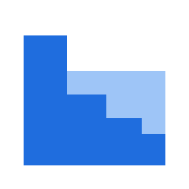

# Option A — inline with title

---

#  dcallocate

- :heavy_dollar_sign: **DCA-friendly rebalancing.** Default mode is **water-filling**: allocate new contributions to under-weighted assets first, no selling, minimizing fees and realized-gains tax.

---

 

# Option B — small block above title

---

  

# dcallocate

- :heavy_dollar_sign: **DCA-friendly rebalancing.** Default mode is **water-filling**: allocate new contributions to under-weighted assets first, no selling, minimizing fees and realized-gains tax.
